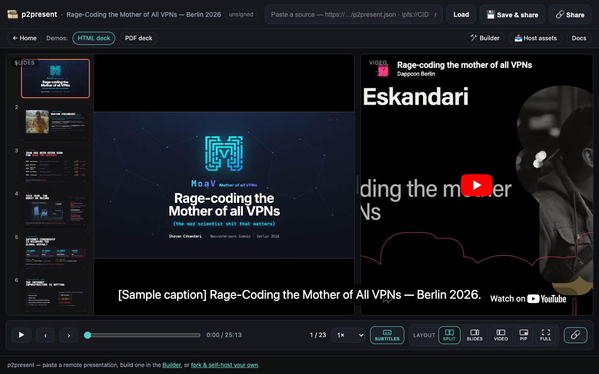
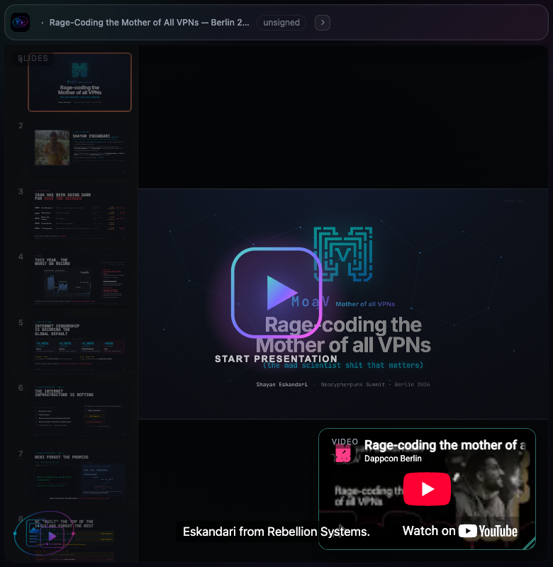
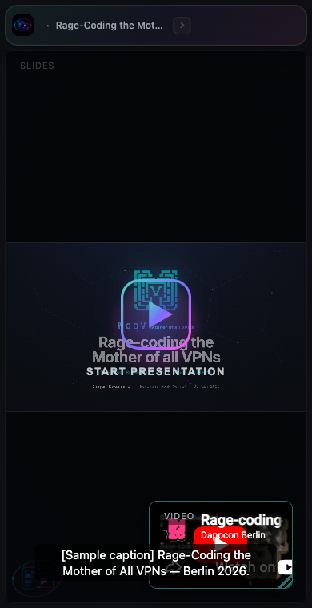
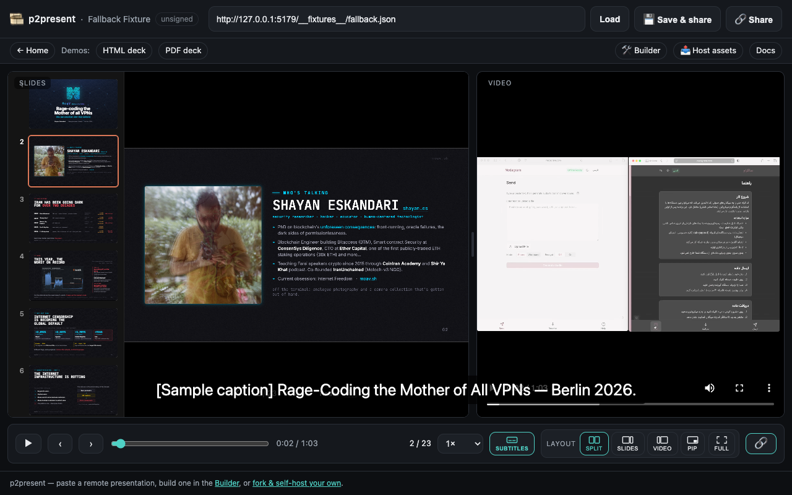
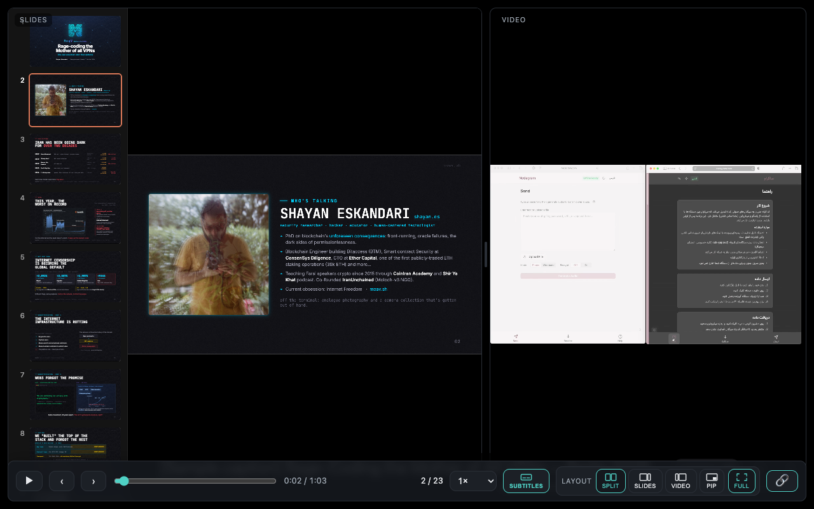
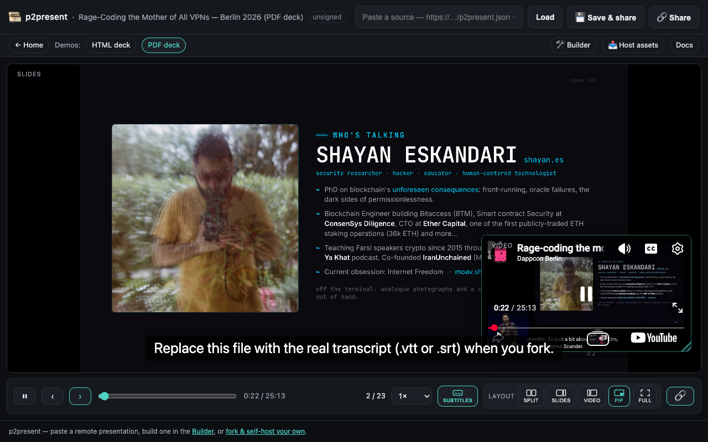
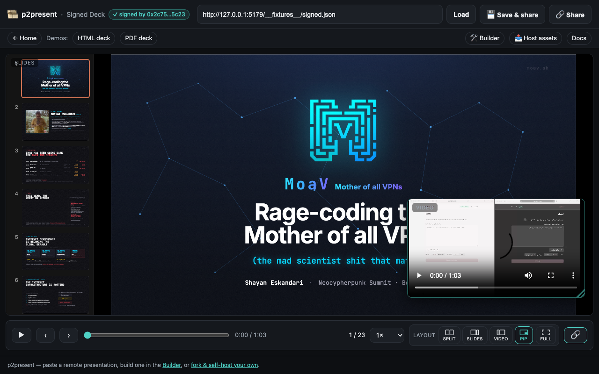
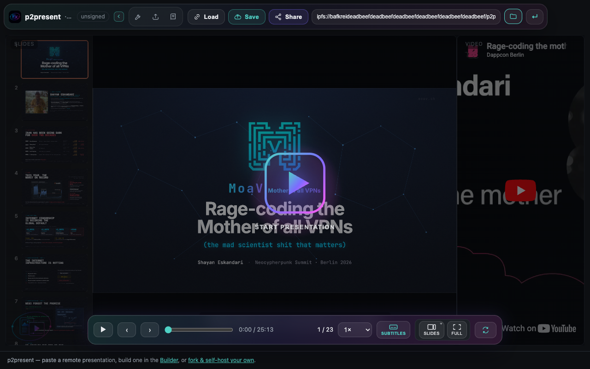
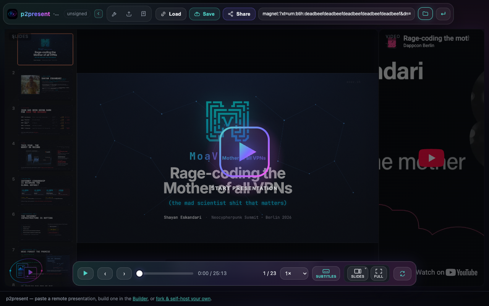

# p2present 🎞️

**A forkable web app for presentation pages where the slides and the talk video play back in sync.**

p2present is a tiny, dependency-light, **static** site (no server runtime). It has two faces from one repo:

1. **Resolver host** — a landing page with a source box. Paste a remote presentation **source** — an `https://…/p2present.json`, an **`ipfs://` CID**, or a **`magnet:` link** — and it fetches the manifest + assets (over whichever transport) and renders the synced player. Content can live anywhere, including the decentralized web.
2. **Forkable self-host template** — fork the repo, drop your own slides + video + timing JSON into `docs/content/`, enable GitHub Pages, and you have your own instance.

**▶ Home:** https://ibeezhan.github.io/p2present/ — the landing page. The player lives at **[`/app/`](https://ibeezhan.github.io/p2present/app/)**.

The "Load the MoaV demo" button opens the *"Rage-Coding the Mother of All VPNs"* deck (23 slides) synced to its [YouTube talk](https://www.youtube.com/watch?v=uYygWN1MZDE). The same talk also ships as a **PDF-deck** demo that exercises the pdf.js adapter:

| | |
|---|---|
| **[HTML deck demo](https://ibeezhan.github.io/p2present/app/?p=demo)** | `<deck-stage>` web-component slides in an iframe |
| **[PDF deck demo](https://ibeezhan.github.io/p2present/app/?p=moav-pdf)** | the same slides rendered from a PDF with pdf.js |
| **[🛠 Builder](https://ibeezhan.github.io/p2present/builder/)** | assemble a `p2present.json` visually (live preview + schema validation) |
| **[📤 Host helper](https://ibeezhan.github.io/p2present/host/)** | pin a file to IPFS / seed a WebTorrent in the browser |

> Legacy player links on the root (`/?p=…`, `/?src=…`, `/?manifest=…`, `/?demo`) auto-redirect to `/app/`, so older shared links keep working.

### Documentation

- **[SPEC.md](SPEC.md)** — the canonical `p2present.json` manifest reference (every field, source transports, loading/share formats, deep-links) + a [JSON Schema](docs/p2present.schema.json).
- **[AUTHORING.md](AUTHORING.md)** — make a presentation start-to-finish: slides → host assets → build the manifest → share.
- **[HOSTING.md](HOSTING.md)** — where to put your assets (plain URLs, IPFS, WebTorrent) and how each maps to a manifest entry.
- **[SERVICE.md](SERVICE.md)** — the optional "Save & share" sharing service (a self-deployable Cloudflare Worker + KV that hosts manifests behind short `…/p/<id>` links).
- **[DOCS.md](DOCS.md)** — a one-page index of everything above.
- **[ROADMAP.md](ROADMAP.md)** — what's next: community manifest hosting, paid persistence (Arweave pay-once + pinning/seedboxes), and an ENS/EAS verified registry. Open core, free forever.

---

## Screenshots

Captured with the headless-Chrome smoke harness (`npm run smoke`).

**Player — slides synced to the YouTube talk (1280 / 780 / 390 px):**



| 780 px | 390 px (mobile) |
|--------|-----------------|
|  |  |

**`mp4` provider via source fallback** — a manifest whose first `ipfs` source is unreachable falls through to a self-hosted `mp4`, which plays in the native `<video>`:



**Fullscreen auto-hiding controls** — in fullscreen/maximized the control bar floats as a fixed overlay that fades out after ~2.5s and returns on activity (never reflowing the slides/video):



**PDF-deck demo** (`?p=moav-pdf`) — the same talk rendered from a PDF with pdf.js, with a **slide thumbnail** on the scrubber:



**Signed manifest — the player verifies on load and badges the signer** (`✓ signed by 0x…`, or an ENS name when one resolves):



**Tools — the [Builder](https://ibeezhan.github.io/p2present/builder/) and [Host helper](https://ibeezhan.github.io/p2present/host/):**

| Builder (live JSON + validation) | Host (IPFS pin / WebTorrent seed) |
|----------------------------------|-----------------------------------|
|  |  |

**Decentralized resolver — `ipfs://` and `magnet:` source states:**

| `ipfs://` (gateway fallback) | `magnet:` (WebTorrent) |
|------------------------------|------------------------|
|  |  |

> **Headless note.** The `ipfs://` / `magnet:` shots use deliberately unreachable
> demo CIDs/hashes (and run in a sandbox with no IPFS peers), so they capture the
> **resolver input + real loading / gateway-fallback UI** rather than completed
> p2p playback — the `ipfs` panel shows every gateway being tried in order, and
> the `magnet` panel shows the live swarm fetch. With a real CID/magnet and peers
> available, the same code streams straight into the player (the `mp4`-fallback
> shot above exercises the identical `<video>` path that `webtorrent`/`ipfs` feed).

---

## What's in the box

- **Flexible player layout** — slides + video with a **draggable divider** and **four layout modes** (split · slides-focus · video-focus · overlap picture-in-picture), animated transitions, **fullscreen**, and a responsive mobile stack. The divider ratio, mode, and PiP position/size persist across visits. See [Layout controls](#layout-controls).
- **Bidirectional sync engine** — playing/scrubbing the video advances slides per the timing JSON; navigating slides (keyboard / wheel / click) seeks the video to that slide. A 🔗 toggle unlinks them. Sync keeps working in every layout mode.
- **Subtitles / captions** — load `.vtt` **and** `.srt` (converted in-browser) tracks, with a **Subtitles menu** to pick language / off and choose **placement**: a **full-window overlay** across the whole player (default) or inside the video pane (native `<track>` on mp4). See [Subtitles](#subtitles).
- **Pluggable deck adapters** — `html` (reveal.js-style / `<deck-stage>` web components, in an iframe), `pdf` (rendered with pdf.js), and `embed` (an external slide URL — Google Slides / SpeakerDeck / Canva — in an iframe). Add more behind one interface.
- **Pluggable video providers** with **source fallback** — `youtube` (IFrame API), `mp4` (HTML5 `<video>`), **`webtorrent`** (stream a magnet into `<video>` via `file.renderTo`), and **`ipfs`** (play a CID through gateway fallback). List several sources and the player uses the first that loads, gracefully falling through when a p2p source can't be reached. See [Decentralized sources](#decentralized-sources-p2p).
- **Decentralized loading & sharing** — load a whole presentation from `https` / `ipfs://` / `magnet:`, deep-link with `?manifest=` / `?p=`, or pack a self-contained `?src=<base64>` link with the **🔗 Share** button. See [Loading & sharing](#loading--sharing).
- **Signed manifests** — optionally **sign** a `p2present.json` with an Ethereum wallet / key (**EIP-191** `personal_sign`) or a raw **Ed25519** keypair in the Builder; the player verifies it on load and shows a **“✓ signed by `<ENS / domain / 0x…>`”** badge (Ethereum addresses reverse-resolve to **ENS**). The signature covers the whole manifest, so any edit invalidates it — and it **never blocks playback**. Dependency-free crypto (`docs/src/crypto/`). See [SPEC → sig](SPEC.md#sig) · [AUTHORING → Sign it](AUTHORING.md#step-5--sign-it-optional).
- **Thumbnail scrubber + deep-links** — hovering/seeking the timeline shows a **slide preview** for that moment (PDF pages are rendered live; HTML decks use authored thumbnails or a slide-label card). Open the player at an exact spot with `#t=<seconds>&slide=<n>`; the hash tracks where you are, and the **🔗 Share** menu's "copy link to this moment" copies a link to the current spot. See [Loading & sharing](#loading--sharing).
- **Visual manifest builder** — the **[Builder](https://ibeezhan.github.io/p2present/builder/)** assembles a `p2present.json` from a form (video sources, deck, timing, subtitles, resolvers, layout) with a live JSON preview, **schema validation**, download / copy / open-in-player, load-existing, and a **timing-capture** helper that stamps the playing video's time against the current slide.
- **In-browser asset hosting** — the **[Host helper](https://ibeezhan.github.io/p2present/host/)** pins a file to **IPFS** (via your own Pinata / web3.storage token, stored only in your browser) or creates + seeds a **WebTorrent** in the tab, handing the resulting `ipfs://` / `magnet:` reference to the Builder. See [HOSTING.md](HOSTING.md).
- **Modular slide transitions** — `cut` · `fade` · `slide` · `none`, in an extensible registry.
- **Polished controls** — play/pause, scrub-to-seek (with thumbnail preview), slide counter, playback speed (0.75–2×), keyboard + mouse-wheel navigation, **auto-hiding overlay controls in fullscreen**, accessible labels, reduced-motion aware.

> **Manifest schema:** full reference in **[SPEC.md](SPEC.md)** with a validation [JSON Schema](docs/p2present.schema.json).

---

## Quick start (run locally)

No build step. Any static file server works:

```bash
git clone https://github.com/ibeezhan/p2present
cd p2present
npm run preview          # serves ./docs at http://localhost:5173  (uses `serve`)
# …or:  python3 -m http.server 5173 --directory docs
```

Open http://localhost:5173. The demo loads automatically.

> Modules are loaded via native ES modules and the YouTube/pdf.js libraries from a CDN, so you **must** serve over `http(s)` (opening `index.html` from `file://` won't work).

---

## Fork & self-host

The whole site is served from the **`docs/`** folder on GitHub Pages — no build, no Actions.

1. **Fork** this repo (or use it as a template).
2. **Add your content** under `docs/content/<your-talk>/`:
   - your slides (an HTML deck folder, or a single PDF),
   - a `manifest.json` (schema below).
3. **Point the demo at it** (optional): edit `DEFAULT_SOURCE` in `docs/src/main.js`, or just visit `?p=<your-talk>` (loads `content/<your-talk>/manifest.json`).
4. **Enable Pages:** repo **Settings → Pages → Build and deployment → Deploy from a branch → `main` / `docs`**. Save.
5. Your site goes live at `https://<you>.github.io/<repo>/`.

> ⚠️ **Keep the `docs/.nojekyll` file.** GitHub Pages runs Jekyll by default, which ignores files/folders that start with `_` (the demo deck ships a `_ds/` design-system folder). `.nojekyll` disables that.

You can also point the **resolver** at any remote manifest without forking the player: `https://ibeezhan.github.io/p2present/app/?manifest=https://your-host.example/p2present.json` (or an `ipfs://` / `magnet:` source). For cross-host `https`, the remote host must send permissive **CORS** headers for the JSON and assets.

---

## Manifest & timing schema

A presentation is one `manifest.json`. The current **`p2present.json` v1.0** schema (full reference + examples in **[SPEC.md](SPEC.md)**, machine-readable [`docs/p2present.schema.json`](docs/p2present.schema.json)):

```jsonc
{
  "p2present": "1.0",
  "title": "My Talk",
  "meta": { "author": "", "event": "", "date": "", "description": "" },
  "video": {
    "sources": [                                  // ordered fallback list
      { "provider": "youtube", "src": "uYygWN1MZDE" },
      { "provider": "mp4",     "src": "video/talk.mp4" }
    ],
    "poster": "video/poster.jpg"
  },
  "deck":  { "type": "html", "sources": [ { "src": "slides/index.html" } ], "slideCount": 23 },
  "timing": [                                      // inline array, OR a string path to an external JSON file
    { "time": 0.0,  "slide": 1, "transition": "cut"  },
    { "time": 12.5, "slide": 2, "transition": "fade" }
  ],
  "subtitles": [ { "lang": "en", "label": "English", "src": "subs/en.vtt", "default": true } ],
  "resolvers": { "ipfsGateways": ["https://{cid}.ipfs.dweb.link"], "webtorrentTrackers": ["wss://tracker.openwebtorrent.com"] },
  "layout": { "split": 0.6, "mode": "split", "transition": "fade" },
  "sig": { "alg": "eip191", "signer": { "address": "0x…" }, "signature": "0x…", "canon": "p2/jcs-1" }  // optional — see SPEC → sig
}
```

Highlights (see **[SPEC.md](SPEC.md)** for every field):

- **`video.sources`** — a fallback list; the player tries each until one loads (`youtube`, `mp4`, `webtorrent`, `ipfs`). **`deck.sources`** is likewise a fallback list, and may itself include `ipfs://` / `magnet:` entries.
- **`deck.type`** — `html`, `pdf`, or `embed` (an external slide URL shown read-only in an iframe; set `deck.slideCount`, and optionally `deck.embed` for deep-linking — see [SPEC.md](SPEC.md#deck)).
- **`timing`** — one cue per slide boundary; either inline, or a **string path to an external JSON file**. Each cue: `time` (float **seconds**, or `"HH:MM:SS.mmm"` / `"MM:SS"`), **1-based** `slide`, optional `transition` (`cut` | `fade` | `slide` | `none`) and `label`. Cues are sorted by time; the slide shown is the last cue whose `time` ≤ the video's current time.
- **`subtitles`** — `.vtt` / `.srt` caption tracks (see [Subtitles](#subtitles)).
- **`resolvers`** — override IPFS gateways / WebTorrent trackers used by the `ipfs` / `webtorrent` providers, P2P decks, and `ipfs://` asset resolution.
- **`layout`** — default split ratio, mode, and caption placement (see [Layout controls](#layout-controls) / [Subtitles](#subtitles)).
- **`sig`** *(optional)* — an author signature (`eip191` Ethereum / `ed25519`). Verified on load → a **“✓ signed by …”** badge; never blocks playback. Sign it in the Builder. See [SPEC → sig](SPEC.md#sig).
- Relative `src` values (deck, mp4, subtitles, poster, external timing) resolve against the **manifest's own URL**; `ipfs://` and `magnet:` srcs resolve over their respective transports.

---

## Decentralized sources (P2P)

Any `src` — the manifest, the video, the deck, an asset — can be one of three transports:

| Transport | Example `src` | How it loads |
|-----------|---------------|--------------|
| **https** | `https://host/p2present.json` | fetched directly (CORS required for cross-host) |
| **ipfs**  | `ipfs://bafy…/p2present.json` or a bare `Qm…`/`bafy…` CID | tried across `resolvers.ipfsGateways` (default dweb.link → ipfs.io → cloudflare) until one responds |
| **magnet**| `magnet:?xt=urn:btih:…` | added to the WebTorrent swarm with `resolvers.webtorrentTrackers`; the matching file is streamed (`<video>`) or read into a Blob URL (deck / manifest) |

```jsonc
"video": {
  "sources": [
    { "provider": "webtorrent", "src": "magnet:?xt=urn:btih:…&dn=talk.mp4" },
    { "provider": "ipfs",       "src": "ipfs://bafy…/talk.mp4" },
    { "provider": "mp4",        "src": "https://cdn.example/talk.mp4" }   // graceful fallback
  ]
}
```

> **No hard gateway dependency.** If your manifest uses only `https` URLs on your
> own server, p2present never contacts a public gateway or tracker. `ipfs`/`magnet`
> are opt-in per source and always fall through to the next `sources[]` entry when
> the swarm/gateway can't be reached (no peers, blocked WSS, timeout).

WebTorrent's browser bundle and the IPFS gateways are reached lazily, only when a
manifest actually references those transports.

---

## Loading & sharing

The resolver host decides what to load from the URL query — **first match wins**:

| Link | Loads |
|------|-------|
| `?src=<base64>` | base64-decoded value is **either** an inline `p2present.json` **or** a source URL/CID/magnet (auto-detected). The compact, self-contained share format. |
| `?manifest=<url>` | a `p2present.json` from any transport (`https` / `ipfs://` / `magnet:`). |
| `?p=<name>` | a bundled local manifest at `content/<name>/manifest.json` shipped in your fork (e.g. `demo`, `moav-pdf`). |
| `?p=<id>` | any **other** value is a saved-presentation id, fetched from the [sharing service](SERVICE.md) (`<service>/api/p/<id>`). The short `…/p/<id>` link redirects here. |
| `?demo` | alias for the bundled MoaV PDF demo (`?p=moav-pdf`). |
| *(none)* | the bundled HTML demo. |

All player links live under **`/app/`** (the root `/` is the landing page; legacy root player links redirect to `/app/`).

```
# load over each transport
…/p2present/app/?manifest=https://host.example/p2present.json
…/p2present/app/?manifest=ipfs://bafy…/p2present.json
…/p2present/app/?manifest=magnet:?xt=urn:btih:…
# a bundled local deck
…/p2present/app/?p=demo
…/p2present/app/?p=moav-pdf            # the PDF-deck demo (also …/app/?demo)
```

The header's **🔗 Share** button opens a small popover (YouTube-style) with two
options: **Copy presentation link** (a self-contained `…?src=<base64>` link to the
whole presentation) and **Copy link to this moment** (the same link plus a
`#t=…&slide=…` deep-link to the current slide + time). Either copies to your
clipboard with a confirmation.

Next to it, **💾 Save & share** POSTs the current manifest to the
[sharing service](SERVICE.md) and copies back a short `…/p/<id>` link — no file to
host yourself. The edit token is kept in your browser so you can update the same
id later. The service base URL is configurable (default placeholder), so a fork
points it at its own self-deployed Worker; see **[SERVICE.md](SERVICE.md)**.

### Deep-links (`#t=…&slide=…`)

A **hash fragment** opens the player at a specific spot and combines with any of
the loaders above:

```
…/p2present/app/?p=demo#t=575&slide=13      # open at 9:35, slide 13
…/p2present/app/?src=<base64>#t=120          # open a shared deck at 2:00
```

`t` is seconds into the video; `slide` is a 1-based slide number (either may be
omitted). The hash updates (debounced) as you navigate, and the Share menu's
**📍 Copy link to this moment** option copies a `?src=<base64>#t=…&slide=…` link to
exactly where you are.

---

## Layout controls

The control bar has a **layout-mode switcher** (and `m` cycles modes; `f` toggles fullscreen):

Each mode is shown as a small glyph that **depicts its pane split**, with a short
label (hidden on narrow screens) and a tooltip:

| Mode | Glyph | What it does |
|------|-------|--------------|
| **Split** | two equal panes | Slides + video side by side, with a **draggable divider** — grab the handle between the panes to resize. On portrait phones the split stacks vertically and the divider becomes a horizontal grab bar dragged **up/down**. |
| **Slides** | large + small | Slides large, video small on the side. |
| **Video** | small + large | Video large, slides small on the side. |
| **PiP** (overlap) | full pane + corner inset | Slides fill the stage; the video floats as a **draggable, resizable picture-in-picture** (drag its title bar, resize from the corner grip). |
| **Full** | corner-bracket frame | Fullscreen (see below). |

The mode switcher and fullscreen button are grouped under a labelled **Layout** cluster in the control bar. Mode changes animate smoothly, and keyboard / scroll / sync keep working in every mode. The divider ratio, current mode, and PiP geometry are saved to `localStorage` and restored on the next visit; the manifest's `layout.split` / `layout.mode` set the initial defaults.

The **Full** button (or `f`) takes the whole player fullscreen. Where the browser supports the Fullscreen API it uses it; on iOS Safari — which doesn't expose fullscreen for arbitrary elements — it falls back to a CSS **maximized** full-viewport mode, so the button always works. `Esc` (or the button) exits. In fullscreen the **control bar auto-hides** after ~2.5s of inactivity, floating back in (as a fixed overlay that never reflows the slides/video) on any mouse-move, tap, or key press.

### On mobile

The player is tuned for phones: panes use dynamic-viewport units (`dvh`/`svh`) so the iOS Safari toolbar can't break the height or cause a double scrollbar; every control is a ≥44px touch target; and the "Paste a manifest URL" bar collapses behind a small **Load URL** disclosure so the player gets the full screen. Both portrait and landscape are handled (landscape phones keep the side-by-side split).

---

## Subtitles

Add caption tracks under `subtitles[]`:

```jsonc
"subtitles": [
  { "lang": "en", "label": "English", "src": "subs/en.vtt", "format": "vtt", "default": true },
  { "lang": "fa", "label": "فارسی",   "src": "subs/fa.srt", "format": "srt" }
]
```

- Both **WebVTT** (`.vtt`) and **SubRip** (`.srt`) are accepted — `.srt` is converted to WebVTT in the browser at load. `format` is inferred from the extension if omitted.
- A **Subtitles** menu in the control bar picks the language (or turns captions off; `"default": true` selects the track shown on load) **and chooses where captions are drawn** (`layout.captionPlacement`):
  - **Full window** *(default)* — captions overlay along the bottom of the **whole player** (slides + video together), readable in every layout mode and in fullscreen. Driven by the sync clock; works for any provider (YouTube **or** mp4).
  - **Over video** — captions stay inside the video pane: native HTML5 `<track kind="subtitles">` for **mp4**, or a synced overlay-in-pane for **YouTube**.

  The viewer's choice is persisted to `localStorage` and overrides the manifest default. Set the default in the manifest with `"layout": { "captionPlacement": "window" | "video" }`.
- The bundled demo ships a couple of **sample** cues (clearly marked as samples) under `docs/content/demo/subtitles/` so the feature is demonstrable — replace them with a real transcript when you fork.

### Generate a starter `timing[]` — `import-chapters`

Turn YouTube chapters or pasted timestamps into a `timing[]` array:

```bash
# From a yt-dlp .info.json (uses its "chapters" array):
yt-dlp --write-info-json --skip-download "https://youtu.be/uYygWN1MZDE"
node scripts/import-chapters.mjs uYygWN1MZDE.info.json

# From pasted "MM:SS Title" / "HH:MM:SS Title" lines:
pbpaste | node scripts/import-chapters.mjs
node scripts/import-chapters.mjs chapters.txt --transition fade

# Write the cues straight into a manifest (preserving its other keys):
node scripts/import-chapters.mjs talk.info.json --merge docs/content/demo/manifest.json
```

It emits one cue per chapter/timestamp, slides numbered `1..N` in order — adjust slide numbers and transitions to taste afterward.

---

## Extending

Everything domain-specific is a small module in a registry. The flow: `manifest → Player → { DeckAdapter, VideoProvider } ↔ SyncEngine`.

### Add a video provider
Create `docs/src/video/<name>.js` extending `BaseVideoProvider` (implement `load/play/pause/seek/getTime/getDuration/setRate/isPlaying/destroy`), then register it in `docs/src/video/index.js`:
```js
videoProviders.register('vimeo', VimeoProvider);
```
Use it with `"video": { "sources": [ { "provider": "vimeo", "src": "…" } ] }`. See `youtube.js` / `mp4.js` (and `webtorrent.js` / `ipfs.js` for p2p providers) for reference.

### Add a deck type
Create `docs/src/decks/<name>.js` extending `BaseDeckAdapter` (implement `load`, `slideCount`, `currentSlide` (1-based), `goTo(slide, opts)`, and **emit `'slidechange'`** on internal navigation), then register in `docs/src/decks/index.js`:
```js
deckAdapters.register('mdx', MyMdxAdapter);
```
See `html-deck.js` (iframe + `<deck-stage>`/reveal.js/generic-sections), `pdf-deck.js` (pdf.js), and `embed-deck.js` (external embeddable slide URL in an iframe).

### Add a transition
Create `docs/src/transitions/<name>.js` exporting `{ name, run({ incoming, outgoing, container, duration, direction }) }` (returns a Promise), then register in `docs/src/transitions/index.js`. Use it via a cue's `"transition"`.

---

## How sync stays loop-free

The engine derives the active slide purely from `slideAtTime(videoTime)`. When the deck reports an internal navigation, it seeks the video **only if** the video's current time doesn't already map to that slide — so video-driven slide changes never bounce back as seeks. The `🔗` toggle flips `linked` to decouple both directions.

> **Note on remote HTML decks:** same-origin decks (the demo, and your forked self-host) get full bidirectional control via the iframe's `contentWindow`. A *cross-origin* remote HTML deck can still report its slide changes (via `postMessage`) but can only be *pushed* by reloading at `#<index>` — host your deck same-origin for smooth sync.

---

## Roadmap

**Phase 2 — shipped:**

- ✅ **WebTorrent video provider** — stream the talk from a magnet (`docs/src/video/webtorrent.js`).
- ✅ **IPFS video + asset provider** — play / fetch from a CID via gateway fallback (`docs/src/video/ipfs.js`).
- ✅ **P2P decks** — `deck.sources` may be `ipfs://` or `magnet:`.
- ✅ **Resolver decentralisation** — load the whole presentation from an `https` URL, `ipfs://` CID, or `magnet:` source.
- ✅ **base64 / query-arg loading** — `?manifest=` · `?src=<base64>` (inline-or-source) · `?p=<local>`, plus a 🔗 **Share** button.

**Phase 3 — shipped:**

- ✅ **Visual manifest [Builder](https://ibeezhan.github.io/p2present/builder/)** — build/edit a `p2present.json` with live preview + schema validation + timing capture.
- ✅ **[Host helper](https://ibeezhan.github.io/p2present/host/)** — pin to IPFS (your own token) / seed a WebTorrent in-browser; see [HOSTING.md](HOSTING.md).
- ✅ **PDF-deck demo** — a second demo (`?p=moav-pdf`) exercising the pdf.js adapter.
- ✅ **Thumbnail scrubber** — slide previews on hover/seek (PDF pages rendered live; HTML via authored thumbnails).
- ✅ **Deep-links** — `#t=<seconds>&slide=<n>` opens at a spot; the hash tracks navigation; a 📍 "this spot" share variant.

**Phase 7 — shipped:**

- ✅ **Sharing service (pastebin-lite)** — a self-deployable [Cloudflare Worker + KV](SERVICE.md) that hosts manifests behind short `…/p/<id>` links: **💾 Save & share** in the player, `?p=<id>` loading, edit tokens (hashed server-side), expiry, public/unlisted, size cap + rate limit + report endpoint, and an optional IPFS mirror on save.

**Phase 8 — shipped:**

- ✅ **Signed manifests** — sign a `p2present.json` with an Ethereum wallet / key (**EIP-191**) or a raw **Ed25519** keypair in the Builder; the player verifies on load and badges the signer (**ENS** reverse-resolved for Ethereum), never blocking playback. Dependency-free crypto in `docs/src/crypto/` + `docs/src/sign.js`; scheme in [SPEC → sig](SPEC.md#sig).

**Next up:**

- Optional in-page Helia (gateway-free IPFS) when the runtime is feasible.
- Per-slide notes / transcript track; authored HTML-deck thumbnail capture.
- Paid persistence (Arweave pay-once + pinning/seedboxes) and a verified registry — see [ROADMAP.md](ROADMAP.md).

---

## Project layout

```
SPEC.md                   # canonical manifest schema reference
AUTHORING.md HOSTING.md   # start-to-finish authoring + asset-hosting guides
SERVICE.md                # the optional "Save & share" service (Worker + KV) guide
DOCS.md                   # one-page documentation index
docs/                     # ← GitHub Pages root (served as-is, no build)
  index.html  app.css     # resolver shell + chrome styles
  p2present.schema.json   # JSON Schema for the v1.0 manifest
  .nojekyll               # keep! lets _ds/ assets through Pages
  builder/                # visual manifest builder (index.html, builder.js/.css)
  host/                   # IPFS pin + WebTorrent seed helper (index.html, host.js/.css)
  src/
    main.js               # resolver: source (https/ipfs/magnet/base64/service id) → manifest → Player; deep-link hash; Save & share
    service.js            # client for the sharing service (save/update/report; configurable base URL)
    player.js             # layout modes + divider + fullscreen + scrubber thumbnails + deep-links + input
    sync.js               # bidirectional timeline engine
    subtitles.js          # vtt/srt parsing + caption rendering (track + overlay)
    manifest.js  time.js  # load/validate (p2present.json v1); HH:MM:SS parser
    resolve.js            # https/ipfs/magnet transports + base64 + WebTorrent client
    schema-validate.js    # tiny dependency-free JSON-Schema validator (Builder)
    sign.js               # manifest signing/verify: canonical JSON + EIP-191 + Ed25519 + ENS describe
    crypto/  { keccak, secp256k1, base64url, ens }   # dependency-free signing primitives
    registry.js           # generic plugin registry
    decks/   { base, index, html-deck, pdf-deck, embed-deck }   # adapters expose thumbnail()
    video/   { base, index, youtube, mp4, webtorrent, ipfs }
    transitions/ { index, cut, fade, slide, none }
  content/demo/           # the bundled HTML-deck demo (deck + manifest + subtitles)
  content/moav-pdf/       # the bundled PDF-deck demo (slides.pdf + manifest)
service/                  # ← optional "Save & share" backend (Cloudflare Worker + KV)
  src/worker.js           # the Worker: POST/GET/PUT/DELETE/report; expiry; rate limit; IPFS mirror
  wrangler.toml           # deploy config (KV binding, vars; no secrets) — see SERVICE.md
  test/worker.test.mjs    # handler unit tests against a mock KV
scripts/  { import-chapters, test, smoke }
```

## License

MIT (see `LICENSE`). The bundled demo deck under `docs/content/demo/` belongs to its original author and is included for demonstration only — replace it with your own when you fork.
